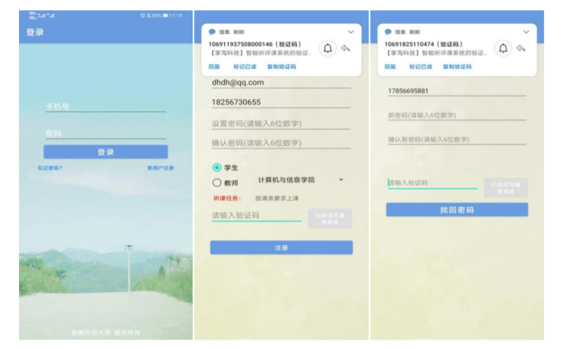
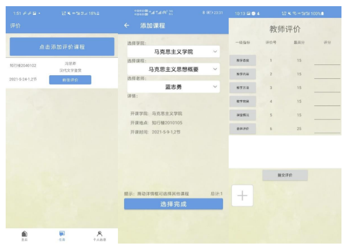

### 介绍

* 项目名称：师生听评课系统
* 项目用途：2021年计算机设计大赛参赛作品
* 项目描述：基于Android与SpringBoot编写的项目
* 作者：Master，L_TiLer

### 基本功能

**学生模块**

* 首页学校各种相关工作的通知
* 学期末学生提交听课评价 

**教师模块**

* 首页学校各种相关工作的通知
* 查看并添加听课任务
* 查看听课记录
* 提交听课评价，并上传听课现场照片（多张，多角度）
* 查看他人的匿名评语，以及查看对自身评分数据进行统计分析的报告（可视化工具）
* 查看本学期自身总体得分和所教授课程的单科评分排名 

**职能部门、督导团、各级领导模块**

* 首页学校各种相关工作的通知 
* 查看并添加听课任务
* 查看听课记录 
* 提交听课评价，并上传听课现场照片（多张，多角度）
* 查看对教师的评分数据进行统计分析的报告（可视化工具）
* 查看教师的各项相关排名
* 查看教师听课时所拍摄的现场照片，检查教师听课任务是否完成 

**管理员模块**

* 查看账号信息 
* 导出学生评价信息
* 导入学生课表

### 效果展示

